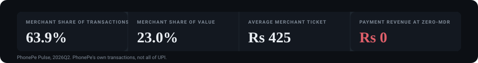
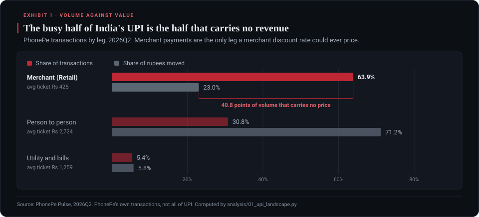
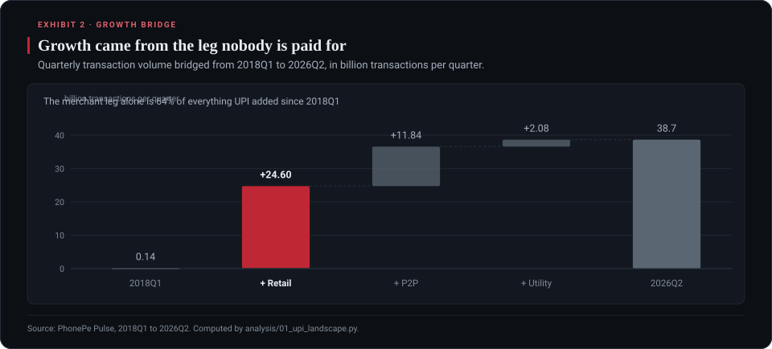
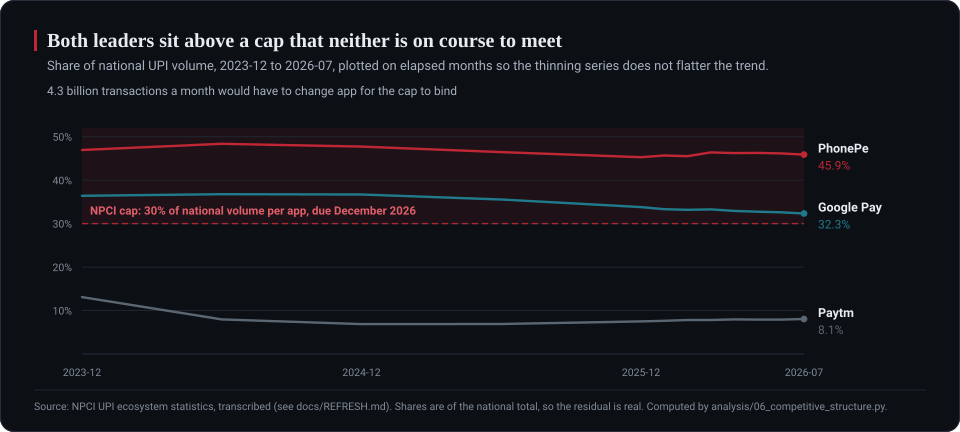
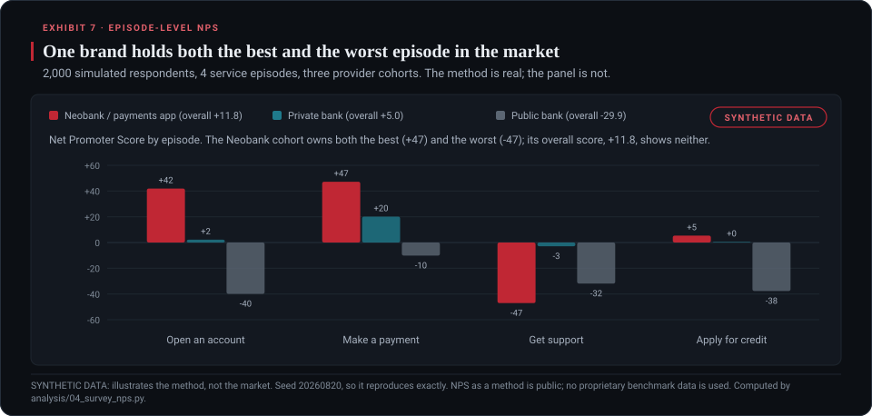
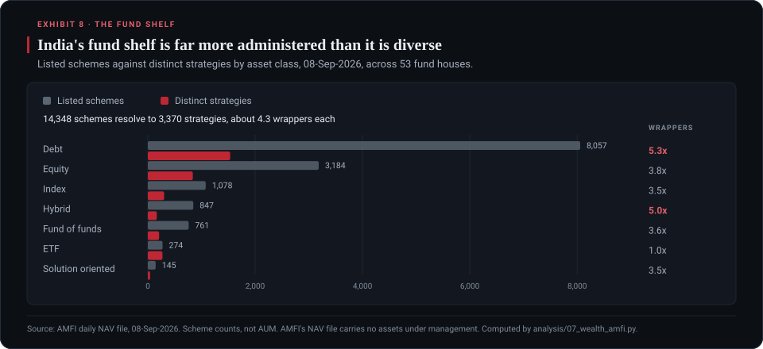
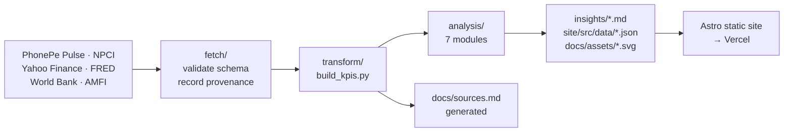

<h1 align="center">India FS Pulse</h1>

<p align="center">
  <strong>Who captures the value in India's UPI, when the busiest half of the network is priced at zero?</strong><br>
  A reproducible research portfolio on Indian financial services: payments, bank margins, market structure and wealth.
</p>

<p align="center">
  <a href="https://india-fs-pulse.vercel.app"></a>
  <a href="LICENSE"></a>
  <a href=".github/workflows/refresh-data.yml"></a>
  
  
</p>

<p align="center">
  <a href="https://india-fs-pulse.vercel.app"><strong>Read the report</strong></a> ·
  <a href="insights/pov-upi-monetization.md">Point of view</a> ·
  <a href="insights/diligence-merchant-payments.md">Diligence memo</a> ·
  <a href="docs/sources.md">Sources and provenance</a> ·
  <a href="docs/data-dictionary.md">Data dictionary</a>
</p>



---

## The finding

India built the world's largest real-time payments network, and priced the busy half at zero.

In 2026 Q2, merchant payments were **63.9% of all transactions but only 23.0% of the rupees
moved**. Person-to-person transfers were the mirror image: 30.8% of transactions, 71.2% of
value. The merchant leg is the only one a merchant discount rate could ever be charged on, and
under India's zero-MDR regime it earns **nothing**: 50.7 million merchants, 487 transactions
each per quarter, ₹2.07 lakh of GMV each, ₹0 of payment revenue.



The market that carries it is **concentrated at the same time as it is unmonetised**. This
repository is the analysis behind that claim: a reproducible Python pipeline over seven public
sources, seven analysis modules, and a static site. **Every figure traces to a committed dataset
and a dated source. Nothing is typed in by hand, and that includes the nine exhibits, the key
figures table and the machine-readable summary on this page.**

## Key figures

<!-- BEGIN:KEYFIGURES -->
| Finding | Figure | Source and period |
|---|---|---|
| Merchant payments: share of transactions against share of value | **63.9% / 23.0%** | PhonePe Pulse, 2026Q2 |
| Person to person, the mirror image | 30.8% / 71.2% | PhonePe Pulse, 2026Q2 |
| Payment revenue earned on the merchant leg under zero-MDR | **Rs 0** | PhonePe Pulse, 2026Q2 |
| What 30bps would have been worth on that same leg | Rs 3,144 crore per quarter | PhonePe Pulse, 2026Q2 |
| Merchant contribution to all volume growth since 2018Q1 | **64%** | PhonePe Pulse, 2018Q1 to 2026Q2 |
| PhonePe and Google Pay share of national UPI volume | **45.9% / 32.3%**, both above the 30% cap | NPCI, 2026-07 |
| Transactions that must change app for the cap to bind | **4.3 bn a month** | NPCI, 2026-07 |
| Private against public bank margin gap | **114 bps** (59 pricing, 56 funding) | Yahoo Finance, FY2026 |
| Five year price return, public against private banks | **+293% / +18%** median | Yahoo Finance, 2021-08-23 to 2026-08-21 |
| Merchant share of own transactions: most against least, material states | **Delhi 68.5% against West Bengal 56.4%** | PhonePe Pulse, 2026Q2 |
| UPI transactions per banked adult per month | **14.9**, up from 4.0 in 2021 | World Bank Findex and NPCI, 2024 |
| Fund schemes against distinct strategies | **14,288 to 3,353** (4.3x wrappers) | AMFI, 20-Aug-2026 |
<!-- END:KEYFIGURES -->

## Questions this repository answers

### Who captures the value in India's UPI if the network charges nothing?

**Not the payment itself. The value sits with whoever owns the merchant relationship, because
the merchant leg is 63.9% of transactions, 64% of all growth since 2018, and 0% of payment
revenue.** UPI is priced at zero for merchants by regulation, so a payment app's return has to
come from what the merchant relationship makes possible next: credit, settlement float,
software, distribution. Underwrite the distribution, not the transaction.



Read: [Underwrite distribution economics, not transaction economics](insights/diligence-merchant-payments.md)

### What is zero-MDR, and what would a merchant discount rate be worth?

**Zero-MDR is the rule that forbids charging Indian merchants for UPI acceptance. On PhonePe's
merchant volume alone, a 30bps rate would be worth about ₹3,144 crore a quarter; the rule makes
it ₹0.** The scenarios in `analysis/03_pe_diligence.py` price the same volume at 0, 10, 30 and
50 basis points, so the size of the forgone pool is explicit rather than rhetorical. Per
merchant, 30bps is about ₹2,480 a year against ₹2.07 lakh of GMV.

Read: [India's payments network monetises the wrong leg](insights/pov-upi-monetization.md)

### Will the NPCI 30% market share cap bind on PhonePe and Google Pay?

**Not on the current trajectory. PhonePe holds 45.9% of national UPI volume and Google Pay
32.3%, so roughly 4.3 billion transactions a month would have to change app for the cap to
bind, and at the observed rate of share drift the leader reaches 30% in about 470 months.**
Concentration is falling, but through the tail gaining rather than the leaders shedding.

The first exhibit draws the market as area: column width is share of transactions, column
height is average ticket, so the area of each column is the rupees it moves. It shows that
scale and ticket size are unrelated. CRED is the tallest column in the market and 0.6% of it.




Read: [Concentrated and unmonetised at once, which is why the share cap cannot bind](insights/pov-market-structure.md)

### Which Indian states run on merchant payments, and which on person-to-person?

**Delhi puts 68.5% of its own UPI transactions through merchants; West Bengal puts 56.4%. India
runs two different payments markets, not one.** The measure is a state's merchant transactions
as a share of its own transactions, taken from the per-state category files rather than derived
from average ticket size, which would have produced a tautology.

All 36 states and union territories are on the map. Seven of them render at under 2% of the
largest state's area, so they get numbered markers and a key rather than being present but
invisible.


Read: [India runs two different payments markets, not one](insights/gap-geographic.md)

### Why do Indian private banks out-earn public banks on margin?

**Roughly half pricing and half funding: of the 114bps margin gap in FY2026, 59bps comes from
what private banks earn on assets and 56bps from what they pay for deposits.** The interesting
part is stability. The policy rate travelled 250bps across FY2023 to FY2026 and the gap moved
2bps, which says the advantage is structural rather than cyclical.

The market had already decided. Over five years the public bank cohort returned a median
**+293%** against the private cohort's **+18%**, and the two cohorts do not overlap at any
point: the worst public bank beat the best private one.


Read: [The private-bank margin advantage is half pricing, half funding](insights/pov-deposit-war.md)

### What does episode-level NPS show that a brand-level score hides?

**That a single brand can hold both the best and the worst experience in a market.** The
neobank cohort scores +47 on making a payment and -47 on getting support. Its overall score,
+11.8, shows neither. Measuring satisfaction per episode rather than per brand is what turns a
survey into a roadmap, because it names the episode to fix.

The panel below is **synthetic and labelled synthetic**, in the filename, on the chart, in the
memo and in the module docstring. It demonstrates the method; it is not evidence about the
market. Replacing it with real fieldwork is the top item in the backlog.



Read: [Episode-level NPS reveals what brand-level NPS hides](insights/survey-nps-episodes.md)

### How much of India's mutual fund shelf is packaging rather than strategy?

**Most of it. 14,288 listed schemes resolve to 3,353 distinct strategies, about 4.3 wrappers
each.** Debt is the heaviest at 5.3 wrappers per strategy, and ETFs are the honest exception at
1.0, because an ETF cannot easily be sold in growth, dividend, direct and regular flavours.
This is a scheme count and not assets under management, which is stated on the chart, because
AMFI's public NAV file carries no AUM.



Read: [India's fund shelf is four times more administered than it is diverse](insights/wealth-fund-shelf.md)

### Is there an investable business model in Indian payments?

**Yes, but not in the payment.** The investable object is the merchant relationship and what
can be sold through it, in a market where acquisition is subsidised by regulation and the
incumbent leaders cannot easily be dislodged by a cap that does not bind. The diligence memo
carries an explicit ambiguity register for the parts that public data cannot settle, including
the largest one: the state-level merchant mix above is PhonePe's, and no open source publishes
a second operator's to check it against.

Read: [Diligence memo, with the ambiguity register](insights/diligence-merchant-payments.md)

## Research outputs

| | |
|---|---|
| **Point of view** | [India's payments network monetises the wrong leg](insights/pov-upi-monetization.md) |
| **Sector scan** | [The private-bank margin advantage is half pricing, half funding](insights/pov-deposit-war.md) |
| **PE diligence** | [Underwrite distribution economics, not transaction economics](insights/diligence-merchant-payments.md), with an explicit ambiguity register |
| **Survey analytics** | [Episode-level NPS reveals what brand-level NPS hides](insights/survey-nps-episodes.md) *(synthetic panel, clearly labelled)* |
| **Market structure** | [Concentrated and unmonetised at once, which is why the share cap cannot bind](insights/pov-market-structure.md) |
| **Wealth and asset management** | [India's fund shelf is four times more administered than it is diverse](insights/wealth-fund-shelf.md) |
| **Gap analysis** | [India runs two different payments markets, not one](insights/gap-geographic.md) |
| **Method** | [Sources and provenance](docs/sources.md) · [data dictionary](docs/data-dictionary.md) · [stack decisions](docs/stack-decisions.md) |

### The interactive half

The exhibits above are static because a README is. The report itself carries a linked
workbench: pick a state on the map or in the table and the other two follow it, switch between
the map and an equal-area cartogram, change the ranking metric and every label rewrites, filter
the 36 rows as you type. No BI backend, no page reload, and the whole thing is server-rendered
markup plus one small script.

[](https://india-fs-pulse.vercel.app#workbench)

**[Open it on the live site](https://india-fs-pulse.vercel.app#workbench)**

## Run it

```bash
pip install -r requirements.txt
python run.py all
```

`python run.py data` runs end to end in about two minutes and needs **no credentials**. Every
source is public and unauthenticated, which is also why the monthly refresh in CI cannot fail
silently on an expired token.

| Command | Does |
|---|---|
| `python run.py data` | Fetch, validate and transform to KPIs (8 fetchers, 17 processed datasets) |
| `python run.py analyze` | Regenerate every memo, chart dataset and README exhibit (deterministic) |
| `python run.py site` | Build the static site |
| `python docs/build_docs.py` | Regenerate the provenance docs from the fetchers' ledger |

## Architecture



**Stack:** Python 3.12+ with pandas · Astro 5 static output · Tailwind v4 · ECharts, lazily
imported · seven hand-written SVG chart components · Vercel · GitHub Actions monthly refresh.
Accessibility, Best Practices and SEO all score 100 in Lighthouse on the production URL.

The README exhibits share no code with the site. They are drawn by
[`docs/build_readme_charts.py`](docs/build_readme_charts.py) in about 600 lines of stdlib
Python, with no plotting dependency, on the site's own palette from
`site/src/styles/tokens.css`.

## Three rules the pipeline enforces

1. **Never fabricate a number.** Not fetched or computed means it stays a visible gap. Four
   months NPCI does not publish are left empty rather than interpolated.
2. **Fail loud on shape change.** Each fetcher validates schema and plausible range. The bank
   fetcher refused to run when a margin came back negative, correctly: the company was a
   payments firm, not a bank.
3. **Synthetic data announces itself**, in the filename, on the chart, and in the memo. One
   dataset here is synthetic and it says so in four places.

The same discipline applies to this page. The nine exhibits, the key figures table and the
machine-readable summary are all written by `docs/build_readme_charts.py` from the committed
data, so the README cannot drift from the pipeline.

## Data spine

Access dates and per-dataset terms are recorded for every dataset in
[`docs/sources.md`](docs/sources.md), which is generated from the fetchers' own provenance
ledger, so it cannot drift from what was actually fetched.

| Source | Coverage | Access |
|---|---|---|
| [PhonePe Pulse](https://github.com/PhonePe/pulse) | 2018 Q1 to 2026 Q2 | open, no auth |
| NPCI per-app statistics | 2023-12 to 2026-07 | transcribed ([why](docs/REFRESH.md)) |
| NPCI monthly statistics | 2016-07 to 2026-07 | open mirror to 2023-08, then transcribed ([why](docs/REFRESH.md)) |
| Yahoo Finance, 11 NSE tickers | 5 years | open |
| FRED, India call money rate | 1968-01 to 2026-06 | keyless CSV endpoint |
| World Bank Open Data | to 2025 | open |
| AMFI scheme universe | daily | open |

The NPCI series joins two sources. The overlap month agrees to the rupee across both, so there
is no level shift at the seam, and the site colours the two halves differently rather than
merging them silently.

**Why PhonePe Pulse and not NPCI's headline series:** Pulse is open, needs no auth, is current
to 2026 Q2, and is the only feed that splits person-to-person from merchant, which is the
monetisation question. The NPCI CKAN mirror everyone reaches for is frozen at 2023-08.

## Machine-readable summary

<!-- BEGIN:FACTS -->
```yaml
name: India FS Pulse
url: https://india-fs-pulse.vercel.app
repository: https://github.com/DogInfantry/india-fs-pulse
license: Apache-2.0
author: Anklesh Rawat
question: >-
  India built the world's largest real time payments network and charges
  nothing for the merchant leg. Who captures the value, and is there an
  investable business model?
method: reproducible Python pipeline, then analysis, then a static site
publishers: 7
fetchers: 8
analysis_modules: 7
processed_datasets: 17
credentials_required: none
findings:
  - metric: merchant share of UPI transactions
    value: 0.6386
    unit: share of transactions
    period: 2026Q2
    source: PhonePe Pulse
  - metric: merchant share of UPI value
    value: 0.2304
    unit: share of rupees
    period: 2026Q2
    source: PhonePe Pulse
  - metric: person to person share of UPI value
    value: 0.7119
    unit: share of rupees
    period: 2026Q2
    source: PhonePe Pulse
  - metric: payment revenue on the merchant leg under zero-MDR
    value: 0.0
    unit: INR crore per quarter
    period: 2026Q2
    source: PhonePe Pulse
  - metric: registered merchants
    value: 50705249
    unit: count
    period: 2026Q2
    source: PhonePe Pulse
  - metric: PhonePe share of national UPI volume
    value: 0.4589
    unit: share of national volume
    period: 2026-07
    source: NPCI
  - metric: Google Pay share of national UPI volume
    value: 0.3233
    unit: share of national volume
    period: 2026-07
    source: NPCI
  - metric: NPCI per app volume share cap
    value: 0.3
    unit: share of national volume
    period: due December 2026
    source: NPCI
  - metric: transactions that must change app for the cap to bind
    value: 4312.7
    unit: millions per month
    period: 2026-07
    source: NPCI
  - metric: private against public bank net interest margin gap
    value: 114
    unit: basis points
    period: FY2026
    source: Yahoo Finance fundamentals
  - metric: median five year price return, public banks
    value: 2.9294
    unit: price return
    period: 2021-08-23 to 2026-08-21
    source: Yahoo Finance prices
  - metric: median five year price return, private banks
    value: 0.1794
    unit: price return
    period: 2021-08-23 to 2026-08-21
    source: Yahoo Finance prices
  - metric: highest merchant share of own transactions, material states
    value: Delhi 0.6851
    unit: share of own transactions
    period: 2026Q2
    source: PhonePe Pulse
  - metric: lowest merchant share of own transactions, material states
    value: West Bengal 0.5643
    unit: share of own transactions
    period: 2026Q2
    source: PhonePe Pulse
  - metric: mutual fund schemes against distinct strategies
    value: 14288 to 3353
    unit: count
    period: 20-Aug-2026
    source: AMFI
caveats:
  - PhonePe Pulse covers PhonePe's own transactions, not all of UPI.
  - The NIM figure is a proxy: net interest income over average total assets.
  - The NPS panel is synthetic and labelled synthetic everywhere it appears.
  - Four months NPCI does not publish are left as gaps, never interpolated.
```
<!-- END:FACTS -->

## How to cite

```bibtex
@software{rawat_india_fs_pulse_2026,
  author  = {Rawat, Anklesh},
  title   = {India FS Pulse: who captures the value in India's UPI under zero-MDR},
  year    = {2026},
  url     = {https://github.com/DogInfantry/india-fs-pulse},
  license = {Apache-2.0}
}
```

## Licence and notes

Code in this repository is licensed under the [Apache License 2.0](LICENSE). **Each dataset
retains its own publisher's terms**, recorded per dataset in
[`docs/sources.md`](docs/sources.md).

Original work. Not affiliated with, endorsed by, or using the trademarks or proprietary data of
any consulting firm. Net Promoter Score is a public method; no proprietary benchmark data is
used. Nothing here is investment advice.

See [`docs/stack-decisions.md`](docs/stack-decisions.md) for what was rejected and why.
