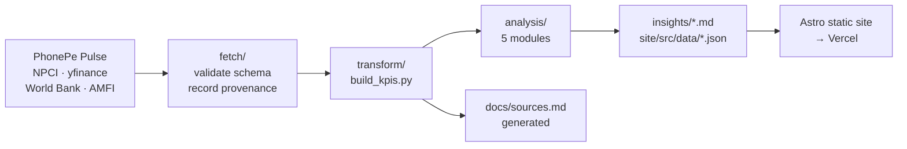

# India FS Pulse

**[Live site →](https://india-fs-pulse.vercel.app)** · [Point of view](insights/pov-upi-monetization.md) · [Diligence memo](insights/diligence-merchant-payments.md) · [Methodology](docs/sources.md)

**India built the world's largest real-time payments network, and priced the busy half at zero.**

In 2026 Q2, merchant payments were **63.9% of all transactions but only 23.0% of the
rupees moved**. Person-to-person transfers were the mirror image: 30.8% of
transactions, 71.2% of value. The merchant leg is the only one a merchant discount
rate could ever be charged on, and under the zero-MDR regime it earns **nothing**:
50.7 million merchants, 487 transactions each per quarter, ₹2.07 lakh of GMV each,
₹0 of payment revenue.

And the market that carries it is **concentrated at the same time as it is unmonetised**:
PhonePe holds 45.9% of national UPI volume and Google Pay 32.3%: both above the 30%
per-app cap due in December 2026. Complying would mean **4.3 billion transactions a
month changing app**. At the observed rate of share drift, the leader reaches the cap
in about 470 months.

This repository is the analysis behind that claim: a reproducible Python pipeline
over six public sources, five analysis modules, and a static site. **Every figure is
computed from a committed dataset. Nothing is typed in by hand.**

## What is here

| | |
|---|---|
| **Point of view** | [India's payments network monetises the wrong leg](insights/pov-upi-monetization.md) |
| **Sector scan** | [The private-bank margin advantage is half pricing, half funding](insights/pov-deposit-war.md) |
| **PE diligence** | [Underwrite distribution economics, not transaction economics](insights/diligence-merchant-payments.md), with an explicit ambiguity register |
| **Survey analytics** | [Episode-level NPS reveals what brand-level NPS hides](insights/survey-nps-episodes.md) *(synthetic panel, clearly labelled)* |
| **Market structure** | [Concentrated and unmonetised at once, which is why the share cap cannot bind](insights/pov-market-structure.md) |
| **Wealth & asset mgmt** | [India's fund shelf is four times more administered than it is diverse](insights/wealth-fund-shelf.md) |
| **Gap analysis** | [India runs two different payments markets, not one](insights/gap-geographic.md) |
| **Method** | [Sources and provenance](docs/sources.md) · [data dictionary](docs/data-dictionary.md) · [stack decisions](docs/stack-decisions.md) |

## Run it

```bash
pip install -r requirements.txt
python run.py all
```

`python run.py data` runs end to end in about 90 seconds and needs **no credentials**.

| Command | Does |
|---|---|
| `python run.py data` | Fetch → validate → transform to KPIs |
| `python run.py analyze` | Regenerate every memo and chart dataset (deterministic) |
| `python run.py site` | Build the static site |

## Architecture



## Three rules the pipeline enforces

1. **Never fabricate a number.** Not fetched or computed → it stays a visible gap. Four
   months NPCI does not publish are left empty rather than interpolated.
2. **Fail loud on shape change.** Each fetcher validates schema and range. The bank
   fetcher refused to run when a margin came back negative, correctly: the company
   was a payments firm, not a bank.
3. **Synthetic data announces itself**: in the filename, on the chart, and in the memo.

## Data spine

Verified live on 2026-08-20. Full provenance, with access dates and per-dataset terms,
is generated into [`docs/sources.md`](docs/sources.md).

| Source | Coverage | Access |
|---|---|---|
| [PhonePe Pulse](https://github.com/PhonePe/pulse) | 2018 Q1 – 2026 Q2 | open, no auth |
| NPCI per-app statistics | 2023-12 – 2026-07 | transcribed ([why](docs/REFRESH.md)) |
| NPCI monthly statistics | 2016-07 – 2026-07 | open mirror to 2023-08, then transcribed ([why](docs/REFRESH.md)) |
| yfinance (11 NSE tickers) | 5 years | open |
| World Bank | to 2025 | open |
| AMFI | daily | open |

The NPCI series joins two sources. The overlap month agrees to the rupee across both,
so there is no level shift at the seam, and the site colours the two halves
differently rather than merging them silently.

## Notes

Original work. Not affiliated with, endorsed by, or using the trademarks or
proprietary data of any consulting firm. Net Promoter Score is a public method; no
proprietary benchmark data is used. Code is MIT licensed; each dataset retains its own
publisher's terms. Nothing here is investment advice.

See [`docs/stack-decisions.md`](docs/stack-decisions.md) for what was rejected and why.
